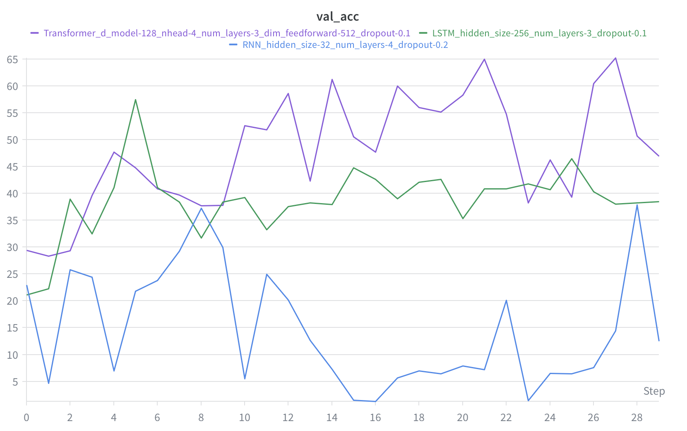
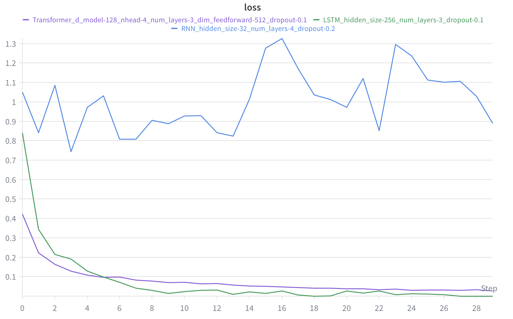
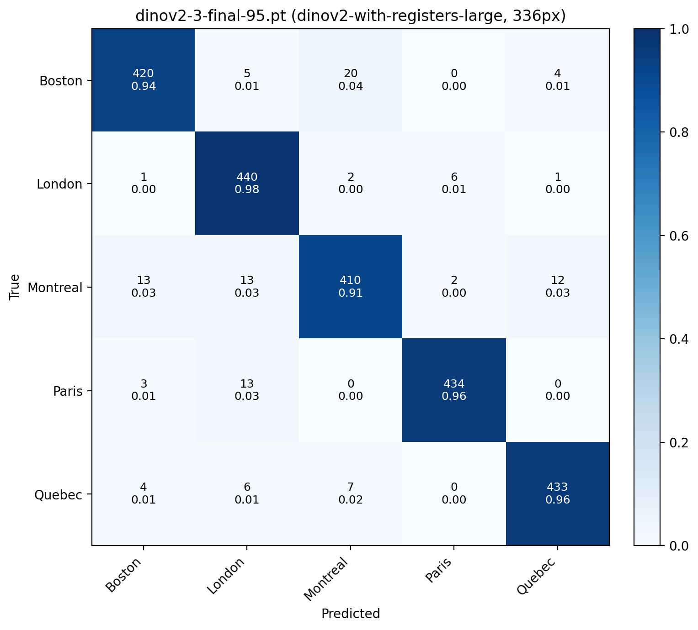
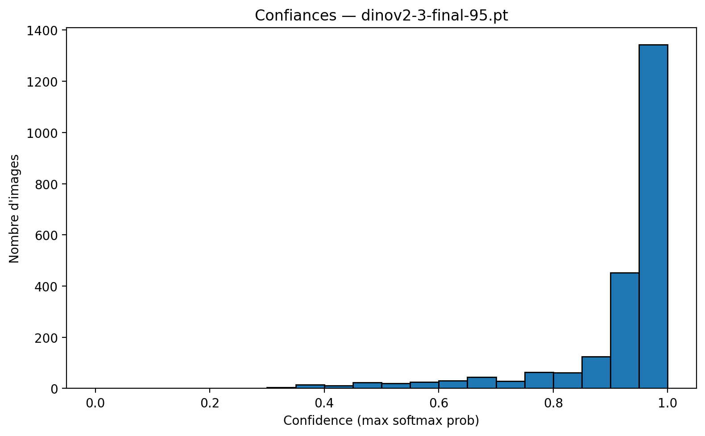

# GLO-7030 Deep Learning

Course projects for GLO-7030 (Université Laval) exploring transfer learning, sequence modeling, and a Kaggle image classification competition.

---

## 1. Transfer Learning on CUB-200-2011

> **Goal:** Compare how different transfer learning strategies affect accuracy on fine-grained bird species classification (200 classes).

We train five configurations on [CUB-200-2011](https://www.vision.caltech.edu/datasets/cub_200_2011/) and measure how much pretrained weights and freezing strategies matter:

| # | Strategy | What's trained |
|---|---|---|
| 1 | ResNet18 from scratch | Everything (random init) |
| 2 | ResNet18 pretrained — all conv frozen | Classification head only |
| 3 | ResNet18 pretrained — layer1 frozen | Everything except early layers |
| 4 | ResNet18 pretrained — fine-tune all | Everything (ImageNet init) |
| 5 | DINOv2-Small — backbone frozen | Linear probe on top of a self-supervised ViT |

We also test robustness to **10% label noise** and compare ImageNet normalization vs dataset-specific normalization.

```bash
cd transfer-learning
python train.py -q a   # ImageNet normalization
python train.py -q b   # dataset-specific normalization
python train.py -q d   # with 10% noisy labels
```

---

## 2. Sequence Classification on BorealTC

> **Goal:** Classify terrain types (ice, snow, gravel...) from robot IMU + proprioception time series using recurrent and attention-based models.

The [BorealTC](https://github.com/norlab-ulaval/BorealTC) dataset contains 10-channel sensor readings from a robot navigating boreal terrain. We apply sliding windows (1.7s, 170 steps) and compare three architectures after a random hyperparameter search logged to [Weights & Biases](https://wandb.ai):

| Model | Best Config | Val Accuracy |
|---|---|---|
| RNN | hidden=32, layers=4, dropout=0.2 | ~35% |
| LSTM | hidden=256, layers=3, dropout=0.1 | ~42% |
| **Transformer** | d_model=128, heads=4, layers=3, ff=512 | **~65%** |

<p align="center">
  
  
</p>
<p align="center"><em>Left: validation accuracy over 30 epochs. Right: training loss. The Transformer clearly outperforms recurrent baselines.</em></p>

```bash
cd sequence-classification
python train.py --mode search     # random hyperparameter search (W&B)
python train.py --mode evaluate   # retrain best configs for 30 epochs
python visualize.py               # plot sample sensor windows
```

---

## 3. Kaggle Competition — "Ou suis-je?"

> **Goal:** Classify street-view images into 5 cities: Boston, London, Montreal, Paris, Quebec.
>
> Competition link: [kaggle.com/competitions/ou-suis-je-h-2026](https://www.kaggle.com/competitions/ou-suis-je-h-2026)

### Approach

We use DINOv2 and DINOv3 (ViT-Large) backbones with a **3-stage progressive training** pipeline:

1. **Head-only** (224px) — backbone frozen, train the classifier head at higher LR
2. **Partial unfreeze** (224px) — unfreeze the last 12-16 transformer blocks, differential LR
3. **Full fine-tune** (392px) — high-resolution with very low backbone LR, label smoothing

### Key techniques

- **Weighted ensemble** of 3 architectures (DINOv2-evolved, DINOv3-evolved, DINOv3-GeM)
- **Montreal/Quebec/Boston specialist** — a separate 3-class model that kicks in when the ensemble is uncertain between these visually similar cities
- **Test-time augmentation** (TTA) — 8 random crops + horizontal flip
- **Pseudo-labels** — high-confidence predictions on test data used as extra training data
- **Multi-seed training** (seeds 3, 13, 291) for ensembling

### Results

<p align="center">
  
  
</p>
<p align="center"><em>Left: confusion matrix showing 91-98% per-class accuracy. Right: most predictions are very confident (>0.9).</em></p>

```bash
cd city-classification
python download.py                          # download from Kaggle
python pipeline.py --model dinov3-evolved   # train a model (3 seeds)
python make_eval.py                         # confusion matrix + error analysis
python make_submission.py                   # weighted ensemble submission
python submit.py submission.csv             # submit to Kaggle
```

---

## Setup

```bash
pip install -r requirements.txt
cp .env.example .env  # fill in WANDB_API_KEY (and optionally HUGGING_FACE_TOKEN for DINOv3)
```

Kaggle credentials go in `~/.kaggle/kaggle.json` (see [Kaggle API docs](https://www.kaggle.com/docs/api)).

## Project Structure

```
transfer-learning/          CUB-200 transfer learning experiments
  train.py                    5 strategies + noisy labels
  dataset.py                  train/test split & NoisyLabelDataset

sequence-classification/    BorealTC time series classification
  train.py                    RNN / LSTM / Transformer + W&B search
  visualize.py                plot sensor windows
  borealtc.py                 dataset & sliding window loader

city-classification/        Kaggle "Ou suis-je?" competition
  pipeline.py                 end-to-end train + submit
  make_submission.py          weighted ensemble + specialist
  make_eval.py                confusion matrix & error analysis
  make_pseudo_labels.py       generate pseudo-labels from test set
  download.py                 download dataset from Kaggle
  submit.py                   submit CSV to Kaggle
  models/                     training scripts per architecture
  utils/                      DINOv2/v3 classifiers, transforms, data utils

assets/                     figures used in this README
```
